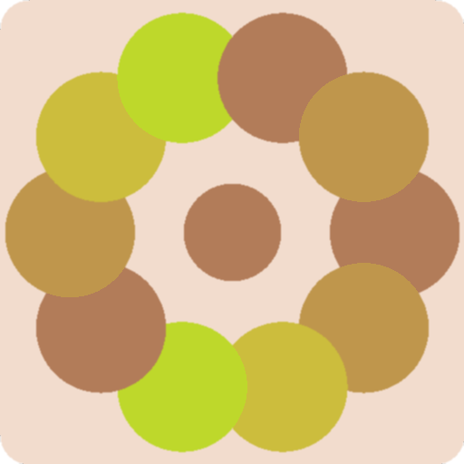

# Fractal

Rust randomly generated fractal graphics.

## Usage

```
Usage: fractal [OPTIONS] <SEED> <OUTPUT>

Arguments:
  <SEED>    RNG seed (number)
  <OUTPUT>  Output path for the PNG (e.g. fractal.png)

Options:
  -b, --border-radius <BORDER_RADIUS>  Border radius for the image corners (in px) [default: 0]
  -w, --width <WIDTH>                  Image width in pixels [default: 800]
  -H, --height <HEIGHT>                Image height in pixels [default: 800]
  -d, --disable-antialias              Disable anti-aliasing
  -h, --help                           Print help
  -V, --version                        Print version
```

## Examples



